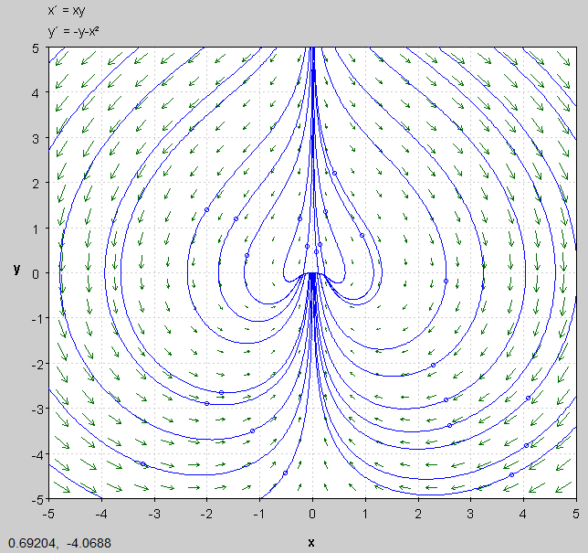

```{r setup, include=FALSE}
knitr::opts_chunk$set(echo = TRUE)
```

#Prelude
This document is written in reference to qualifying exams given at the University of Louisville in past years. These solutions are not given from the University, but of my work alone as a way to study for my own qualifying exam. If any tips or recommendations come up and you feel you should share, feel free to raise an issue on GitHub where I have this document saved and open to the public [here](https://github.com/obewanjacobi/gradwork/tree/master/Classes/Old%20Qualifying%20Exams/My%20Solutions). To see the qualifying exams for yourself, [visit this link](http://www.math.louisville.edu/GraduateFAQ/qualifiers/QualifierStudyGuides/). When referencing the Perko book, this is in reference to the *Differential Equations and Dynamical Systems, 3rd Edition*. Thank you for reading, and for all advice.

Jacob Townson


# What to Expect:

- Mechanical Vibrations: Newton's Laws, spring-mass systems, two-mass oscillators, friction, damping, pendulum, linear stability and equilibria, energy analysis, phase place analysis, nonlinear oscillations, control oscillations, inverse problem

- Traffic Flow: Velocities and velocity fields, traffic flow and density, conservation laws, linear and nonlinear car-following models, steady state, first order partial differential equations, green light models and rarefaction solution, shock waves, highway with entrance, traffic wave propagation, optimization problem. (**NOTE: WE DID NOT COVER TRAFFIC FLOW IN CLASS, THUS IT IS LIKELY TO NOT BE ON THE QUAL THIS SUMMER [2018]**)

- Dynamical Systems: Nonlinear systems in the plane, interacting species, limit cycles, Hamiltonian systems, Liapunov functions and stability, bifurcation theory, three-dimensional autonomous system and chaos, Poincare maps and nonautonomous systems in the plane, linear discrete dynamical systems


# My Solutions from Quals

## Summer 2016

### Consider the initial value problem in $\mathbb{R}$ where $\dot{x} = x^2$ and $x(0) = 1$. (a) Find the first three successive approximations $u_1(t), u_2(t),$ and $u_3(t)$ by using integration. (b) Use mathematical induction to show that for all $n \geq 1$, $u_n(t) = 1+t+...+t^n+O(t)$. (c) Solve the IVP and show that the function $x(t) = \frac{1}{1-t}$ is a solution on the interval $(-\infty,1)$. (d) Show that the first $(n+1)$-terms in $u_n(t)$ agree with the first $(n+1)$-terms in Taylor series of the function $x(t) = \frac{1}{1-t}$ about $t=0$.
#### My Solution:

(a)
Recall
$$u_{k+1}(t) = x_0 + \int_0 ^t f(u_k(s))ds$$

This implies that
$$u_1(t) = x_0 + \int_0 ^t f(x_0) ds \implies 1+ \int_0 ^t 1 ds = 1+t$$,
$$u_2(t) = 1 + \int_0 ^t f(1+s)ds = 1+ \int_0 ^t (s^2 + 2s + 1)ds$$
$$= 1 + \frac{t^3}{3} + t^2 + t$$,

$$u_3(t) = 1+ \int^t _0 f \left(1+s+s^2 +\frac{s^3}{3} \right)ds$$
$$ = 1+ \int^t _0 \left( 1+2s+3s^2+\frac{8s^3}{3} + \frac{5s^4}{3}+\frac{2s^5}{3}+\frac{s^6}{9} \right)ds$$
$$=1+t+t^2+t^3+\frac{2t^4}{3}+\frac{t^5}{3}+\frac{t^6}{9}+\frac{t^7}{63}$$

(b)
Base case: Above, this holds for $u_1,u_2,$ and $u_3$. Suppose it is true for $n-1$, i.e. 
$$u_{n-1}(t) = 1+t+...+t^{n-1}+O(t)$$
Then $u_n = x_0 \int^t _0 f(u_{n-1} (s))ds$. Thus
$$u_n = 1+ \int^t _0 f(1+s+s^2 +...+s^{n-1} + O(t))ds$$
$$= 1+\int^t _0 \left( 1+ 2s +3s^2 + ... + n s^{n-1} + O(t) \right)ds$$
$$=1+t+t^2 +t^3+...+t^n + O(t)$$ as needed. QED

(c)
$\dot x =x^2$ and $x(0) = 1$. So $\int \frac{1}{x^2} dx = \int 1dt$ which implies that $\frac{-1}{x} = t+c$ giving us $x = \frac{-1}{t+c}$. Then we can see that using our initial condition, we get that $x(0) = - \frac{1}{0+c}$. So
$$1 = -\frac{1}{c} \implies c = -1$$
Thus $$x(t) = - \frac{1}{t-1} = \frac{1}{1-t}$$

Note $x(t)$ is undefined at $t=1$ so by definition of the solution $x(t)$ is only a solution on the interval $(- \infty , 1)$.

(d)
The Taylor series of $\frac{1}{1-t}$ at $t=0$ is $1+t+t^2 +...+t^{n+1}$. By induction we used above, we know that 
$$u_{n+1}(t) = 1+t+t^2 +... + t^{n+1} + O(t)$$
So they do in fact agree up to higher order terms.

### Show that the system with $\dot{x} = y$ and $\dot{y} = -2x-y-3x^4+y^2$ has no limit cycle in $\mathbb{R}^2$. (HINT: a function in the form $\mathrm{e}^{\beta x}$ might be useful)
#### My Solution:

Consider $\beta = -2$. Then
$$\frac{\partial}{\partial x} \left( \mathrm{e}^{-2x} \cdot y \right) + \frac{\partial}{\partial y} \left( \mathrm{e}^{-2x} \cdot (-2x-y-3x^4+y^2) \right)$$
$$=-2 \mathrm{e}^{-2x} \cdot y + \mathrm{e}^{-2x} \cdot (-1+2y) = - \mathrm{e}^{-2x}<0$$
Now we apply Dulac's Criteria, and we have proven that there are no limit cycles in $\mathbb{R}^2$.


### Consider the following model defined in $\mathbb{D} = \{(x,y) \in \mathbb{R}^2 : x \geq 0, y\geq 0\}$: $\dot{x} = 1-x-\frac{2xy}{2+x}$, $\dot{y} = y \left( \frac{2x}{2+x} -1\right)$ where $x(0) > 0$ and $y(0) > 0$. 
### (a) Show that the $\omega$-limit set of any orbit is on the set $K = \{(x,y) \in \mathbb{D} : x+y = 1\}$. (b) Show that the system has a unique steady state in $\mathbb{D}$ and the unique equilibrium point is globally stable in $\mathbb{D}$.
#### My Solution:

(a)
Consider the Liapunov function
$$V = (x+y-1)^2$$
Its derivative along the trajectories of the system is 
$$\dot V = 2(x+y-1)(\dot x + \dot y) = 2(x+y-1)\left( 1-x- \frac{2xy}{2+x} + {2xy}{2+x} - y \right)$$
$$=2(x+y-1)(1-x-y) = -2V^2 \leq 0,$$
Thus according to the [LaSalle's invairance principle](https://en.wikipedia.org/wiki/LaSalle%27s_invariance_principle#Global_version), the $\omega$-limit set of the system is contained in $K$.

(b)
The right part of the system is equal to zero iff $x=1$, $y=0$, thus, $(1,0)$ is a unique stady state. $\dot y$ is negative on $K$ except for the point $(1,0)$ (because $\frac{2x}{2+x}<1$ for any $x<2$), thus, $y$ is decreasing along the trajectories on $K$, thus, any solution that contained in $K$ moves toward the point $(1,0)$. It means that the $\omega$-limit set of the system contains the point $(1,0)$ only, i.e. for any initial point in $\mathbb{D}$, $\lim_{t \to \infty} (x(t),y(t))=(1,0).$

In order to prove the global asymptotic stability of $(1,0)$ we need also to prove its (local) Lyapunov stability. It is given by the Lyapunov function $W(x,y) = V(x,y) + y^2$ since the derivative is 
$$\dot W = -2V^2 + 2y^2 \left( \frac{2x}{2+x}-1 \right)$$
is negative in some neighborhood of the equilibrium point $(1,0)$.

Note, we chose these $V$ and $W$ functions because of the following:

In the first case we know the function must be equal to zero on $K$ and positive on $\mathbb{D}/ K$. In the second case, it was just a guess. The simplest possible Lyapunov function is a quadratic form. We need a positive definite quadratic form; $V$ is not positive definite. What can we do to $V$ in order to obtain a positive definite quadratic form? $(x-1)^2$ and $y^2$, fir instance. $y^2$ is suitable for us because its derivative is $\leq 0$ and the overall derivative is negative definite.


### Show that the system with $\dot{x} = x-y-(x^2 + \frac{3}{2} y^2)x$ and $\dot{y} = x+y-(x^2 + \frac{1}{2} y^2)y$ has a limit cycle.
#### My Solution:

Let $\dot x$ and $\dot y$ be defined as above. Then the equilibrium point of this system is $x=0$ and $y=0$. The Jacobian matrix gives us
$$Df(0,0) = \left( \begin{matrix}1 & -1\\ 1 & 1\end{matrix}\right)$$
The eigenvalues are $1+i$ and $1-i$. Hence the system is unstable (node or focus), which is the ***first*** criterion of the Poincare-Bendixon theorem.

Secondly, let us choose a closed bounded subset given by 
$$V(x,y) = x^2 + y^2 \leq c$$
where $c$ is a positive constant. Therefore the closed subset $V(x,y)$ is a circle of radius $\sqrt c$.
We only need to show that there exists a finite value of $c$ for which the vector field of $f(x,y)$ never leaves the set enclosed by $c$. This is identical to the statement:
$$\nabla V(x,y) \cdot f(x,y) \leq 0$$

Now,
$$\nabla V(x,y) \cdot f(x,y) = \frac{\partial V}{\partial x} \dot x + \frac{\partial V}{\partial y} \dot y$$

Therefore
$$\nabla V(x,y) \cdot f(x,y) = 2x \left[ x-y-\left( x^2 + \frac{3}{2} y^2 \right) x \right]+ 2y \left[ x+y- \left(x^2+ \frac{1}{2} y^2 \right) y\right]$$
$$=2(x^2 + y^2) - 2(x^2 + y^2)^2 + y^4 -x^2 y^2$$

But
$$y^4 - x^2 y^2 \leq (x^2 + y^2)^2$$

Therefore
$$2(x^2+y^2) - 2(x^2+y^2)^2 +y^4 -x^2y^2 \leq 2(x^2+y^2) - 2(x^2+y^2)^2-(x^2+y^2)$$
$$= 2(x^2+y^2)-(x^2+y^2)^2$$

This implies that
$$\nabla V(x,y) \cdot f(x,y) \leq 2(x^2+y^2 - (x^2+y^2)^2 = 2c-c^2 = (2-c)c$$

Finally if we choose $c=2$ we are guaranteed that $\nabla V(x,y) \cdot f(x,y) \leq 0$ which satisfies the ***second*** criterion of the Poincare-Bendixson theorem. 

Therefore it can be concluded that a limit cycle does indeed exist. QED


### Determine the qualitative behavior near the non-hyperbolic critical point at the origin for the system with $\dot{x} = xy$ and $\dot{y} = -y-x^2$. Sketch the phase portrait.
#### My Solution:

First off, here it is easy to tell that the only equilibrium point we have here is indeed the origin. Next, let's discuss the behavior of this solution point.

$$Df(x,y) = \left( \begin{matrix}y & x\\ -2x & -1\end{matrix}\right)$$
$$Df(0,0) = \left( \begin{matrix}0 & 0\\ 0 & -1\end{matrix}\right)$$

We get then that our eigenvalues are $\lambda_1 = 0$ and $\lambda_2 = -1$. This shows us that the point is indeed stable, and will behave similarly to a stable node. In other words, any solution will sink towards the origin, however, when approaching from $y > 0$, the trajectory will move around the origin because of the first zero eigenvalue. 

```{r echo=FALSE}
setwd('D:/obewa/Documents/My real documents/University of Louisville/public_work/Classes/Old Qualifying Exams/My Solutions')
```





```{r echo=FALSE}
setwd('D:/obewa/Documents/My real documents/University of Louisville/public_work')
```


### Consider the Lorenz model with $\dot{x} = \frac{3}{2}y-x$, $\dot{y} = \frac{1}{2}x-y-xz$, and $\dot{z} = xy-z$.
### (a) Show that the Lorenz model has a unique equilibrium point. (b) Show that the equilibrium point is globally stable. (HINT: Use a Liapunov function.)
#### My Solution:

(a)
In order to find the equilibrium points, we set $0 = \frac{3}{2} y -x$, $0 = \frac{1}{2}x-y-xz$, and $0 = xy-z$. Then using the first equation, we find that 
$$x = \frac{3}{2}y$$
Inputting this into the third equation gives us 
$$\frac{3}{2}y^2 -z = 0 \implies \frac{3}{2}y^2 = z$$

So finally using the second equation, we get that 
$$0 = \frac{3}{4} y -y- \frac{3}{2}y \cdot \frac{3}{2}y^2 \implies 0=y+9y^3$$
which can only happen if $y=0$. Thus we find that our only possible equilibrium point is the trivial one, $(x,y,z) = (0,0,0)$. 

(b)
Consider $V(x,y,z) = x^2 + 2y^2 + 2z^2$. Then 
$$\frac{d}{dt}V(x,y,z) = 2x \dot x + 4y \dot y + 4z \dot z$$
$$= 2x \left( \frac{3}{2}y-x \right) +4y \left( \frac{1}{2}x-y-xz \right) +4z(xy-z) = 5xy-2x^2-4y^2-4z^2$$

This is a negative definite quadratic form, therefore it is less than $0$ unless $x=y=z=0$. Moreover there is some $k>0$ such that $\frac{d}{dt}V(x,y,z) \leq -k V(x,y,z)$. Therefore for any initial point $x(0), y(0),z(0)$, $V(x,y,z) \leq V(x(0),y(0),z(0)) \mathrm{e}^{-kt}$. In particular, this tells us that $(x,y,z) \to 0$ as $t \to \infty$. Thus our equilibrium point is indeed globally stable. 


### Consider a spring-mass system that describes a motion with a force caused by friction or magnification or both: $\ddot{x} - \epsilon \dot{x} +x - x^3 + x^5 = 0$ where $\epsilon \in (-2,2)$. 
### (a) Without solving the equation, show that $\epsilon = 0$ is a bifurcation point. In more details, show that when $\epsilon = 0$ the system is a Hamiltonian system and find an expression for the Hamiltonian. Then sow that when $\epsilon < 0$ the origin is a stable equilibrium point; but when $\epsilon > 0$ the system has a limit cycle. (b) Classify the type of the bifurcation and then draw the bifurcation diagram. Label the diagram clearly.
#### My Solution:


## Winter 2016

### Consider the predator-prey model with $\dot{x} = x(1-x-y)$ and $\dot{y} = (4x-1)y$. Let $x(0)>0$ and $y(0)>0$. Determine $\lim_{t \to \infty}(x(t),y(t))$.
#### My Solution:


### Consider the predator-prey model with $\dot{x} = x(1-y)$ and $\dot{y} = (2x-1)y$. Show that every non-constant positive solution is periodic.
#### My Solution:


### Prove that the system with $\dot{x} = x+y-4x^3$ and $\dot{y} = y-x-4y^3$ has a limit cycle.
#### My Solution:


### Consider $\dot{x} = y+x^2-y^2$ and $\dot{y} = -x-2xy$. (a) Find all equilibria for this system and determine their stability. (b) Find the Hamiltonian of the system. (c) Find a solution curve that connects a saddle point. (d) Does the curve obtained in (c) connect any other saddle points?
#### My Solution:
a)


b)


c)


d)


### Consider the mass spring system subject to an external force $f(t)$:

$$\ddot{x}+\dot{x}+x=f(t)$$

### Assume $x(0) = 0$ and $\dot{x}(0) = 0$. Assume also that $f(t)$ is the force describing the striking effect on the mass of the mass spring system in a short time period $0<T<\frac{1}{2}$, given as $f(t) = \frac{\pi}{4T}\sin{\frac{\pi t}{2T}}$ when $0 \leq t<2T$ and $f(t) = 0$ when $t \geq 2T$. 

### (a) Solve the given IVP first for all $t \geq 0$. (b) Compute the limits $\lim_{t \to \infty} x(t)$ and $\lim_{t \to \infty} \dot{x}(t)$. (c) Compute the limits $\lim_{T \to 0}x(T)$ and $\lim_{T \to 0} \dot{x}(T)$, and discuss their physical meanings.
#### My Solution:


### Suppose that the motion of a mass is described by the nonlinear differential equation $\frac{d^2 x}{dt^2} + 2x+3(\frac{dx}{dt})^5 = 0$. Determine how solutions of this equation behave.
#### My Solution:


## Summer 2015

### Consider the Lotka-Volterra predator-prey model with $\dot{x} = x(2-y)$ and $\dot{y} = y(x-1)$. Show that every non-constant positive solution is periodic.
#### My Solution:
First note that 
$$\dot{x} = x(2-y) = 0 \implies x = 0, y = 2$$
and
$$\dot{y} = y(x-1) = 0 \implies y = 0, x =1$$

Thus we let $E_0 = (0,0)$ and $E_1 = (1,2)$. Then
$$\dot{V} = \left( 1- \frac{1}{x} \right)(2x-xy)+ \left( 1- \frac{2}{y}  \right)(yx-y)$$
$$= 2x-xy-2+y+yx-y-2x+2 = 0$$

Thus every trajectory along the closed curve $V(x,y) = c$ where $c$ is constant. Thus every non-constant positive solution is periodic.


### Consider the system

$$\dot{x} = y+x\sqrt{x^2+y^2} \sin \left({\frac{1}{\sqrt{x^2+y^2}}} \right), \dot{y} = -x +y \sqrt{x^2+y^2} \sin \left( \frac{1}{\sqrt{x^2+y^2}} \right)$$

### Show that this system has infinitely many limit cycles, and discuss how the solutions behavior. (Hint: use polar coordinates.)
#### My Solution:
$$\dot{r} = r^{-1}\left[\left(y+xr \sin\left(\frac{1}{r}\right)\right)x + \left(-x+yr \sin\left(\frac{1}{r}\right)\right)y\right]$$
$$=r^{-1}\left(xy+x^2 r \sin\left(\frac{1}{r}\right) -xy + y^2 r \sin \left( \frac{1}{r} \right) \right) = r^{-1}r \sin\left( \frac{1}{r}\right)\left( x^2 + y^2 \right)$$
$$=r^2 \left[ \sin \left( \frac{1}{r} \right)(\cos^2 \theta + \sin^2 \theta) \right] = r^2 \sin \left( \frac{1}{r} \right)$$

Note that $r^2 \sin \left( \frac{1}{r} \right)$ equals $0$ on $r = k \pi$. Thus we have an infinite number of limit cycles. 

Now 
$$\dot{\theta} = r^{-2}(x\dot{y}-y\dot{x}) = r^{-2}\left(x\left(-x+yr\sin\left( \frac{1}{r} \right) \right) -y\left(y+xr \sin\left(\frac{1}{r}\right)\right)\right)$$
$$= r^{-2}\left(-x^2 + xyr \sin \left( \frac{1}{r} \right) - y^2 - xyr \sin \left(\frac{1}{r} \right)\right)= r^{-2}\left(-r^2\right) = -1<0$$

Thus the trajectories go clockwise.


### The Hamiltonian function of a Hamiltonian system is given by $H(x,y) = \frac{y^2}{2} - \frac{x^2}{2} + \frac{x^4}{4}$. (a) Find the equilibria of the system and discuss their stability. (b) Sketch the phase portrait for the system.
#### My Solution:
a)


b)


### Consider the predator-prey model

$$\dot{x} = x \left(6-x-\frac{3y}{1+x} \right), \dot{y} = y(x-2)$$

### Assume that all positive solutions are bounded. (a) Find all critical points and determine their local stability. (b) Show that this system has a limit cycle in the first quadrant.
#### My Solution:


### Suppose that the motion of a mass is described by the nonlinear differential equation $\frac{d^2 x}{dt^2} + \frac{dx}{dt} + x^5 = 0$. Determine how solutions of this equation behave.
#### My Solution:


### Suppose that the motion of a mass is described by the nonlinear differential equation $\frac{d^2 x}{dt^2} + x+x^3 = 0$. Determine how solutions of this equation behave.
#### My Solution:


## Summer 2014


# Important Notes

## Notes from Perko Book

Please note, this does not contain anywhere near all of the information contained in the Perko book. Instead, I have only chosen to include what seems absolutely necessary for the exam.

### Linear Systems

- A *phase portrait* of a system of differential equations with $x \in \mathbb{R}^n$ is the set of all solution curves of the DE in the phase space of $\mathbb{R}^n$

- Find eigenvalues using the following: $\det(A-\lambda I) = 0$. For a $2 \times 2$ matrix, this simplifies to 
$$\lambda_1 = \frac{a+d}{2}+\sqrt{\frac{(a+d)^2}{4-ad+bc}}$$
$$\lambda_2 = \frac{a+d}{2}-\sqrt{\frac{(a+d)^2}{4-ad+bc}}$$
where our matrix is $A = \bigl( \begin{smallmatrix}a & b\\ c & d\end{smallmatrix}\bigr)$

- Let $A$ be a square matrix, then 
$$\frac{d}{dt} \mathrm{e}^{At} = A \mathrm{e}^{At}$$


### Nonlinear Systems: Local Theory

- The linear transformation $D \mathbf{f}(\mathbf{x}_0)$ is called the *derivative* of $\mathbf{f}$ at $\mathbf{x}_0$.

- Suppose that $\mathbf{f}: E \rightarrow \mathbb{R}^n$ is differentiable on $E$. Then $\mathbf{f} \in C^1(E)$ if the derivative $D\mathbf{f}:E \rightarrow L(\mathbb{R}^n)$ is continuous on $E$.

- A point $\mathbf{x}_0 \in \mathbb{R}^n$ is called an *equilibrium point* or *critical point* of the nonlinear system if $\mathbf{f}(\mathbf{x}_0)= \mathbf{0}$. An equilibrium point $\mathbf{x}_0$ is called a *hyperbolic equilibrium point* of the nonlinear system if none of the eigenvalues of the matrix $D\mathbf{f}(\mathbf{x}_0)$ have zero real part. The linear system with the matrix $A = D\mathbf{f}(\mathbf{x}_0)$ is called the *linearization* of the nonlinear system at $\mathbf{x}_0$.

***The following 3 facts are important!***

- An equilibrium point $\mathbf{x}_0$ of the nonlinear system is called a *sink* if all of the eigenvalues of the matrix $D\mathbf{f}(\mathbf{x}_0)$ have negative real part. 

- An equilibrium point $\mathbf{x}_0$ of the nonlinear system is called a *source* if all of the eigenvalues of $D\mathbf{f}(\mathbf{x}_0)$ have positive real part. 

- An equilibrium point $\mathbf{x}_0$ of the nonlinear system is called a *saddle* if it is a hyperbolic equilibrium point and $D\mathbf{f}(\mathbf{x}_0)$ has at least one eigenvalue with a positive real part and at least one with a negative real part.

- Any sink is asymptotically stable, and any source or saddle is unstable. Hence any hyperbolic equilibrium point is either asymptotically stable or unstable.

- If $\mathbf{x}_0$ is a stable equilibrium point, no eigenvalue of $D\mathbf{f}(\mathbf{x}_0)$ has positive real part.

- A function $V: \mathbb{R}^n \to \mathbb{R}$ satisfying the hypotheses of the below theorem is called a *Liapunov function*

- Let $E$ be an open subset of $\mathbb{R}^n$ containing $\mathbf{x}_0$. Suppose that $\mathbf{f} \in C^1(E)$ and that $\mathbf{f}(\mathbf{x}_0)=\mathbf{0}$. Suppose further that there exists a real valued function $V \in C^1(E)$ satisfying $V(\mathbf{x}_0) = 0$ and $V(\mathbf{x}) >0$ if $\mathbf{x} \neq \mathbf{x}_0$. Then (a) if $\dot{V}(\mathbf{x}) \leq 0$ for all $\mathbf{x} \in E$, $\mathbf{x}_0$ is stable; (b) if $\dot{V}(\mathbf{x}) < 0$ for all $\mathbf{x} \in E \sim \{\mathbf{x}_0\}$, $\mathbf{x}_0$ is asymptotically stable; (c) if $\dot{V}(\mathbf{x}) > 0$ for all $\mathbf{x} \in E \sim \{\mathbf{x}_0\}$, $\mathbf{x}_0$ is unstable.

- If $\dot{V}(\mathbf{x}) = 0$ for all $\mathbf{x} \in E$ then the trajectories of the system lie on the surfaces in $\mathbb{R}^n$ (or curves in $\mathbb{R}^2$) defined by $V(\mathbf{x}) = c$.

***Note the below 6 facts refer to a two dimentional system, ie. a two dimensional $D\mathbf{f}(\mathbf{x}_0)$ matrix***

- If you have two negative real eigenvalues for $D\mathbf{f}(\mathbf{x}_0)$, then you have a *stable node*.

- If you have two complex eigenvalues with a negative real part for $D\mathbf{f}(\mathbf{x}_0)$, then you have a *stable focus*.

- If you have two positive real eigenvalues for $D\mathbf{f}(\mathbf{x}_0)$, then you have an *unstable node*.

- If you have two complex eigenvalues both with a positive real part for $D\mathbf{f}(\mathbf{x}_0)$, then you have an *unstable focus*.

- If you have one positive real eigenvalue and one negative real eigenvalue for $D\mathbf{f}(\mathbf{x}_0)$, then you have a *saddle*. 

- If you have two complex eigenvalues with real part zero for $D\mathbf{f}(\mathbf{x}_0)$ then you have a *center*.

- Let $E$ be an open subset of $\mathbb{R}^{2n}$ and let $H \in C^2(E)$ where $H = H(\mathbf{x},\mathbf{y})$ with $\mathbf{x,y} \in \mathbb{R}^n$. A system of the form
$$\mathbf{\dot{x}} = \frac{\partial H}{\partial \mathbf{y}}$$
$$\mathbf{\dot{y}} = -\frac{\partial H}{\partial \mathbf{x}}$$
where $\frac{\partial H}{\partial \mathbf{x}}$ and $\frac{\partial H}{\partial \mathbf{y}}$ is called a *Hamiltonian system* with $n$ degrees of freedom on $E$.

- (Conservation of Energy) The total energy $H(\mathbf{x},\mathbf{y})$ of the Hamiltonian system remains constant along the trajectories of the system.

- The total energy for this system $H(x,y) = T(y) + U(x)$ where $T(y) = \frac{y^2}{2}$ is the kinetic energy and 
$$U(x) = - \int_{x_0} ^x f(s) ds$$
is the potential energy.

- The critical points of the Newtonian system all lie on the $x$-axis. The point $x_0,0$ is a critical point of the Newtonian system iff it is a critical point of the function $U(x)$, i.e., a zero of the function $f(x)$. If $(x_0,0)$ is a strict local maximum of the analytic function $U(x)$, it is a saddle for the system. If $(x_0,0)$ is a strict local minimum of the analytic function $U(x)$, it is a center for the system. If $(x_0,0)$ is a horizontal inflection point of the function $U(x)$, it is a cusp for the system. And finally, the phase portrait of the system is symmetric with respect to the $x$-axis.

- Let $E$ be an open subset of $\mathbb{R}^n$ and let $V \in C^2(E)$. A system of the form 
$$\dot{\mathbf{x}} = - \nabla V(\mathbf{x})$$
where 
$$\nabla V = \left( \frac{\partial V}{\partial x_1},..., \frac{\partial V}{ \partial x_n} \right)^T$$
is called a *gradient system on* $E$.


### Nonlinear Systems: Global Theory

- A point $\mathbf{p} \in E$ is an $\omega$-*limit point* of the trajectory $\phi (*,\mathbf{x})$ of the system if there is a sequence $t_n \to \infty$ such that
$$\lim_{n \to \infty} \phi(t_n,\mathbf{x}) = \mathbf{p}$$.

- Similarly to above, if there is a sequence $t_n \to - \infty$ such that 
$$\lim_{n \to \infty} \phi(t_n, \mathbf{x}) = \mathbf{q}$$, at the point $\mathbf{q} \in E$, then the point $\mathbf{q}$ is called an $\alpha$-*limit point* of the trajectory.

- The $\alpha$ and $\omega$-limit sets of a trajectory $\Gamma$ of the system, $\alpha(\Gamma)$ and $\omega(\Gamma)$, are closed subsets of $E$ and if $\Gamma$ is contained in a compact subset of the $\mathbb{R}^n$, then $\alpha(\Gamma)$ and $\omega(\Gamma)$, are non-empty, connected, compact subsets of $E$. 

- A *cycle* or *periodic orbit* of a system is any closed solution curve of the system which is not an equilibrium point of the system

- A *limit cycle* $\Gamma$ of a planar system is a cycle of the system which is the $\alpha$ or $\omega$-limit set of some trajectory of the system other than $\Gamma$. 

- If a cycle $\Gamma$ is the $\omega$-limit set of every trajectory in some neighborhood of $\Gamma$, then $\Gamma$ is called an $\omega$-*limit cycle* or *stable limit cycle*; if $\Gamma$ is the $\alpha$-limit set of every trajectory in some neighborhood of $\Gamma$, then $\Gamma$ is called an $\alpha$-*limit cycle* or an *unstable limit cycle*; and if $\Gamma$ is the $\omega$-limit set of one trajectory other than $\Gamma$ and the $\alpha$-limit set of another trajectory other than $\Gamma$, then $\Gamma$ is called a *semi-stable limit cycle*.

- (**Dulac**) In any bounded region of the plane, a planar analytic system with $\mathbf{f(x)}$ analytic in $\mathbb{R}^2$ has at most a finite number of limit cycles. Any polynomial system has at most a finite number of limit cycles in $\mathbb{R}^2$.

- (**Poincare**) A planar analytic system cannot have an infinite number of limit cycles which accumulate on a cycle of the system.

- If $\Gamma$ and $\omega(\Gamma)$ have a point in common, then $\Gamma$ is either a critical point or a periodic orbit.

- If $\omega(\Gamma)$ contains no critical points $\omega(\Gamma)$ contains a periodic orbit $\Gamma_0$, then $\omega(\Gamma) = \Gamma_0$.

- (**Bendixson's Criteria**) Let $\mathbf{f} \in C^1(E)$ where $E$ is a simply connected region in $\mathbb{R}^2$. If the divergence of the vector field $\mathbf{f}, \nabla \mathbf{f}$ is not identically zero and does not change sign in $E$, then the system has no closed orbit lying entirely in $E$.

- (**Dulac's Criteria**) Let $\mathbf{f} \in C^1(E)$ where $E$ is a simply connected region in $\mathbb{R}^2$. If there exists a function $B \in C^1(E)$ such that $\nabla (B\mathbf{f})$ is not identically zero and does not change sign in $E$, then the system has no closed orbit lying entirely in $E$. If $A$ is an annular region contained in $E$ on which $\nabla(B\mathbf{f})$ does not change sign, then there is at most one limit cycle of the system in $A$.


### Nonlinear Systems: Bifurcation Theory

- (**Sotomayor**) Suppose that $\mathbf{f}(\mathbf{x}_0, \mu _0) = \mathbf{0}$ and that the $n \times n$ matrix $A = D \mathbf{f}(\mathbf{x}_0, \mu_0)$ has a simple eigenvalue $\lambda=0$ with eigenvector $\mathbf{v}$ and that $A^T$ has an eigenvector $\mathbf{w}$ corresponding to the eigenvalue $\lambda = 0$. Furthermore, suppose that $A$ has $k$ eigenvalues with negative real part and $(n-k-1)$ eigenvalues with positive real part and the following conditions are satisfied:
$$\mathbf{w}^T \mathbf{f}_{\mu}(\mathbf{x}_0,\mu_0) \neq 0, \mathbf{w}^T[D^2 \mathbf{f} (\mathbf{x}_0, \mu_0)(\mathbf{v,v})] \neq 0$$
Then there is a smooth curve of equilibrium points of the system in $\mathbb{R}^n \times \mathbb{R}$ passing through $(\mathbf{x}_0,\mu_0)$ and tangent to the hyperplane $\mathbb{R}^n \times \{\mu_0\}$. Depending on the signs of the expressions in the conditions, there are no equilibrium points of the system near $\mathbf{x}_0$ when $\mu<\mu_0$ (or when $\mu > \mu_0$) and there are two equilibrium points of the system near $\mathbf{x}_0$ when $\mu > \mu_0$ (or when $\mu < \mu_o$). The two equilibrium points of the system near $\mathbf{x}_0$ are hyperbolic and have stable manifolds of dimensions $k$ and $k+1$ respectively. I.E. the system experiences a **saddle-node** bifurcation at the equilibrium point $\mathbf{x}_0$ as the parameter $\mu$ passes through the bifurcation value $\mu = \mu_0$. The set of $C^{\infty}$-vector fields satisfying the above condition is an open, dense subset in the Banach space of all $C^{\infty}$, one-parameter, vector fields with an equilibrium point at $\mathbf{x}_0$ having a simple zero eigenvalue.

- If the above conditions are changed to
$$\mathbf{w}^T \mathbf{f}_{\mu} (\mathbf{x}_0,\mu_0) = 0,$$
$$\mathbf{w}^T[D\mathbf{f}_{\mu}(\mathbf{x}_0,\mu_0)\mathbf{v}] \neq 0,$$
$$\mathbf{w}^T[D^2\mathbf{f}(\mathbf{x}_0,\mu_0)(\mathbf{v,v})] \neq 0$$
then the system experiences a **transcritical bifurcation**.

- If the above conditions are changed to
$$\mathbf{w}^T \mathbf{f}_{\mu}(\mathbf{x}_0, \mu_0) = 0,$$
$$\mathbf{w}^T [D \mathbf{f}_{\mu}(\mathbf{x}_0, \mu_0)\mathbf{v}] \neq 0,$$
$$\mathbf{w}^T[D^2 \mathbf{f}(\mathbf{x}_0, \mu_0) (\mathbf{v,v})] = 0,$$
$$\mathbf{w}^T [D^3 \mathbf{f}(\mathbf{x}_0, \mu_0) (\mathbf{v,v,v})] \neq 0$$
then the system experiences a **pitchfork bifurcation**.

- Hopf bifurcations are explained in this book, but I won't include notes on them because I seriously doubt they will be on the exam.


## Other Important Notes

- 


